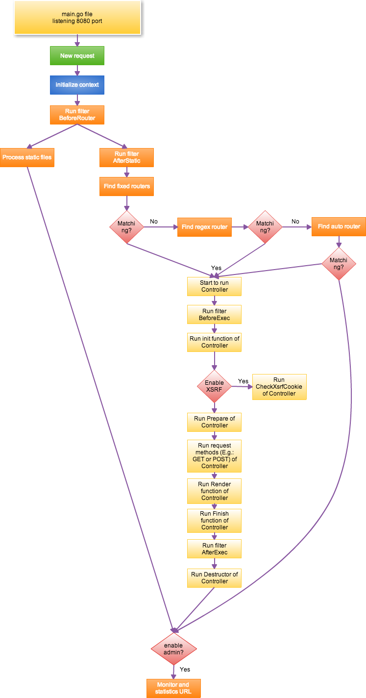

Introduction to Radiant’s MVC
=============================

Radiant uses a typical Model-View-Controller (MVC) framework. This
diagram illustrates how request handling logic is processed:

|image0|

The whole logic handling process is explained below:

1.  Data is recieved from the listening port. The listening port is set
    to 8080 by default.
2.  Radiant begins processing the requested data after the request
    reachs port 8080
3.  The Context object is initialized. WebSocket requests will be set as
    Input after the request method has been verified as a standard
    method (get, post, put, delete, patch, options, head) in order to
    protect from hostile attack.
4.  If the ``BeforeRouter`` filter has been set by the user it is
    executed. If ``responseWriter`` has output data while executing this
    filter the request will be finished and the supervise checking step
    (see item 21) will be performed next.
5.  Start handling of static files. If the requested url matches the
    prefix set by ``StaticDir``, the ``ServeFile`` in the ``http``
    package will be used to handle the static file requests.
6.  If the request is not for a static file, and the session module is
    enabled, the session module will initialize. An error will occur if
    session is being used in the ``BeforeRouter`` filter (see item 4).
    Use the ``AfterStatic`` filter (see item 7) instead to avoid this
    error.
7.  The ``AfterStatic`` filter is executed. If ``responseWriter``
    already has output data while executing this filter the request will
    be finished and the supervise checking step (see item 21) will be
    performed next.
8.  After all filters have been executed Radiant will start to match any
    requested urls with fixed routing rules. These connections will only
    be made if the whole string matches. For example: ``/hello`` does
    not match the url of ``/hello/world``. If any matching pairs are
    found the appropriate logic will execute.
9.  Regex matching is executed based on the order that the user added.
    This means the order of the regex routing rules will affect Regex
    matching. If any matches are found the appropriate logic will
    execute.
10. If the user registered ``AutoRouter``, ``controller/method`` will be
    used to match the Controller and method. If any matches are found
    the appropriate logic will execute. Otherwise the supervise checking
    step (see item 21) will be performed next.
11. If a Controller is found Radiant will start this logic.
    ``BeforeExec`` will execute first. If ``responseWriter`` already has
    output data while executing this filter the request will be finished
    and the supervise checking step (see item 21) will be performed
    next.
12. Controller will start executing the ``Init`` function to initialize
    basic information. ``radical.Controller`` will usually be
    initialized as part of this item, so modifiying this function is not
    recommened while inheriting the Controller.
13. If XSRF is enabled it will call ``XsrfToken`` of ``Controller``. If
    this is a POST request ``CheckXsrfCookie`` will be called.
14. The ``Prepare`` function of ``Controller`` will be executed. This
    function is normally used by the user to launch initialization. If
    ``responseWriter`` already has data while executing this filter it
    will go directly to the ``Finish`` function (see item 17).
15. If there is no output the user registered function will be executed.
    If there is no function registered by the user the method in
    ``http.Method`` (GET/POST and so on) will be called. This will
    execute logic inluding reading data, assigning data, rendering
    templates, or outputing JSON or XML.
16. If there is no output by ``responseWrite`` the ``Render`` function
    will be called to output template.
17. Execute the ``Finish`` function of ``Controller``. This function
    works as an override to allow the user to release resources, such as
    data initialized in ``Init``.
18. Execute the ``AfterExec`` filter. If there is output it will jump to
    the supervise checking step (see item 21).
19. Execute ``Destructor`` in ``Controller`` to release data allocated
    in ``Init``.
20. If there is no router has been found the 404 page will be shown.
21. Eventually, all logic paths lead to supervise checking. If the
    supervisor module is enabled (default on port 8088), the request
    will be sent to supervisor module to log data such as QPS of the
    request, visiting time, and request url.

The next sections will detail the first step of Radiant’s MVC, routing:

-  `Routing <controller/router.html>`__
-  `Controller functions <controller/controller.html>`__
-  `Cross-site request forgery (XSRF) <controller/xsrf.html>`__
-  `Session control <controller/session.html>`__
-  `Message flashing <controller/flash.html>`__
-  `Accessing Request Data <controller/params.html>`__
-  `Multiple Response Formats <controller/jsonxml.html>`__
-  `Form validation <controller/validation.html>`__
-  `Rendering templates <controller/view.html>`__
-  `Template functions <controller/template.html>`__
-  `Error handling <controller/errors.html>`__
-  `Handling static files <controller/static.html>`__
-  `Parameter configuration <controller/config.html>`__

.. toctree::
   :maxdepth: 4
   :caption: Contents:

   rst/quickstart
   rst/quickstart/README

.. toctree::
   :maxdepth: 4
   :caption: Quickstart Introduction:

   rst/quickstart/new
   rst/quickstart/router
   rst/quickstart/controller
   rst/quickstart/model
   rst/quickstart/view

.. toctree::
   :maxdepth: 4
   :caption: Introduction:

   rst/intro/Introduction
   rst/advantage/README
   rst/install/install
   rst/install/radical

.. toctree::
   :maxdepth: 4
   :caption: MVC Introduction:

   rst/mvc/README
.. toctree::
   :maxdepth: 4
   :caption: Controller:

   rst/mvc/controller/config
   rst/mvc/controller/controller
   rst/mvc/controller/error
   rst/mvc/controller/filter
   rst/mvc/controller/flash
   rst/mvc/controller/jsonxml
   rst/mvc/controller/params
   rst/mvc/controller/router
   rst/mvc/controller/session
   rst/mvc/controller/urlbuilding
   rst/mvc/controller/validation
   rst/mvc/controller/xsrf
.. toctree::
   :maxdepth: 4
   :caption: Models:

   rst/mvc/model/overview
   rst/mvc/model/orm
   rst/mvc/model/object
   rst/mvc/model/query
   rst/mvc/model/rawsql
   rst/mvc/model/querybuilder
   rst/mvc/model/transaction
   rst/mvc/model/models
   rst/mvc/model/commandline
   rst/mvc/model/test
   rst/mvc/model/custome_fields
   rst/mvc/model/faq

.. toctree::
   :maxdepth: 4
   :caption: Views:

   rst/mvc/view/view
   rst/mvc/view/template
   rst/mvc/view/static
   rst/mvc/view/page
   rst/mvc/view/global_variables

.. toctree::
   :maxdepth: 4
   :caption: Modules:

   rst/module/README
   rst/module/session
   rst/module/cache
   rst/module/logs
   rst/module/httplib
   rst/module/context
   rst/module/task
   rst/module/config

.. toctree::
   :maxdepth: 4
   :caption: Advanced Radiant:

   rst/advantage/README
   rst/advantage/monitor
   rst/advantage/docs

.. toctree::
   :maxdepth: 4
   :caption: Deployment:

   rst/deploy/README
   rst/deploy/radiant
   rst/deploy/supervisor
   rst/deploy/systemctl
   rst/deploy/nginx
   rst/deploy/apache

.. toctree::
   :maxdepth: 4
   :caption: FAQ:

   rst/faq/FAQ

.. toctree::
   :maxdepth: 4
   :caption: FAQ:

   rst/faq/FAQ