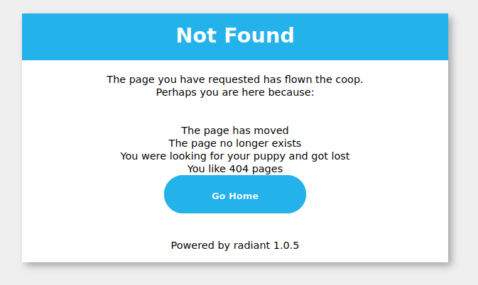

Error Handling
==============

In web development, we need to be able to redirect pages and handle
errors. Radiant uses ``Redirect`` for page redirection and error
handling:

.. code:: go

   func (this *AddController) Get() {
       this.Redirect("/", 302)
   }

If you want to stop this request and throw an exception, you can do this
in Radiant’s controller:

.. code:: go

   func (this *MainController) Get() {
       this.Abort("401")
       v := this.GetSession("asta")
       if v == nil {
           this.SetSession("asta", int(1))
           this.Data["Email"] = 0
       } else {
           this.SetSession("asta", v.(int)+1)
           this.Data["Email"] = v.(int)
       }
       this.TplName = "index.tpl"
   }

The ``this.Abort("401")`` will stop any further execution and it will
show this page:

|image0|

Radiant supports 404, 401, 403, 500, 503 error handling by default. You
can also define a custom error handling page. For example redefined 404
page:

.. code:: go

   func page_not_found(rw http.ResponseWriter, r *http.Request){
       t,_:= template.ParseFiles(web.BConfig.WebConfig.ViewsPath +"/404.html")
       data :=make(map[string]interface{})
       data["content"] = "page not found"
       t.Execute(rw, data)
   }

   func main() {
       web.ErrorHandler("404",page_not_found)
       web.Router("/", &controllers.MainController{})
       web.Run()
   }

We can therefore define our own ``404.html`` page to handle a 404 error.

Another cool feature of Radiant is support for customized string error
handling functions, such as the code below which registers a database
error page:

.. code:: go

   func dbError(rw http.ResponseWriter, r *http.Request){
       t,_:= template.ParseFiles(web.BConfig.WebConfig.ViewsPath+"/dberror.html")
       data :=make(map[string]interface{})
       data["content"] = "database is now down"
       t.Execute(rw, data)
   }

   func main() {
       web.ErrorHandler("dbError",dbError)
       web.Router("/", &controllers.MainController{})
       web.Run()
   }

After registering this error handling code, you can call
``this.Abort("dbError")`` at any point in your code to handle the
database error.

Controller define Error
=======================

Radiant version 1.4.3 added support for Controller defined Error
handlers, so we can use the ``web.Controller`` and ``template.Render``
context functions

.. code:: go

   package controllers

   import (
       "github.com/W3-Engineers-Ltd/Radiant/server/web"
   )

   type ErrorController struct {
       web.Controller
   }

   func (c *ErrorController) Error404() {
       c.Data["content"] = "page not found"
       c.TplName = "404.tpl"
   }

   func (c *ErrorController) Error500() {
       c.Data["content"] = "internal server error"
       c.TplName = "500.tpl"
   }

   func (c *ErrorController) ErrorDb() {
       c.Data["content"] = "database is now down"
       c.TplName = "dberror.tpl"
   }

From the example we can see that all the error handling functions have
the prefix ``Error``\ ，the other string is the name of
``Abort``\ ，like ``Error404`` match ``Abort("404")``

Use ``web.ErrorController`` to register the error controller before
``web.Run``

.. code:: go

   package main

   import (
       _ "btest/routers"
       "btest/controllers"

       "github.com/W3-Engineers-Ltd/Radiant/server/web"
   )

   func main() {
       web.ErrorController(&controllers.ErrorController{})
       web.Run()
   }

.. toctree::
   :maxdepth: 4
   :caption: Contents:

   rst/quickstart
   rst/quickstart/README

.. toctree::
   :maxdepth: 4
   :caption: Quickstart Introduction:

   rst/quickstart/new
   rst/quickstart/router
   rst/quickstart/controller
   rst/quickstart/model
   rst/quickstart/view

.. toctree::
   :maxdepth: 4
   :caption: Introduction:

   rst/intro/Introduction
   rst/advantage/README
   rst/install/install
   rst/install/radical

.. toctree::
   :maxdepth: 4
   :caption: MVC Introduction:

   rst/mvc/README
.. toctree::
   :maxdepth: 4
   :caption: Controller:

   rst/mvc/controller/config
   rst/mvc/controller/controller
   rst/mvc/controller/error
   rst/mvc/controller/filter
   rst/mvc/controller/flash
   rst/mvc/controller/jsonxml
   rst/mvc/controller/params
   rst/mvc/controller/router
   rst/mvc/controller/session
   rst/mvc/controller/urlbuilding
   rst/mvc/controller/validation
   rst/mvc/controller/xsrf
.. toctree::
   :maxdepth: 4
   :caption: Models:

   rst/mvc/model/overview
   rst/mvc/model/orm
   rst/mvc/model/object
   rst/mvc/model/query
   rst/mvc/model/rawsql
   rst/mvc/model/querybuilder
   rst/mvc/model/transaction
   rst/mvc/model/models
   rst/mvc/model/commandline
   rst/mvc/model/test
   rst/mvc/model/custome_fields
   rst/mvc/model/faq

.. toctree::
   :maxdepth: 4
   :caption: Views:

   rst/mvc/view/view
   rst/mvc/view/template
   rst/mvc/view/static
   rst/mvc/view/page
   rst/mvc/view/global_variables

.. toctree::
   :maxdepth: 4
   :caption: Modules:

   rst/module/README
   rst/module/session
   rst/module/cache
   rst/module/logs
   rst/module/httplib
   rst/module/context
   rst/module/task
   rst/module/config

.. toctree::
   :maxdepth: 4
   :caption: Advanced Radiant:

   rst/advantage/README
   rst/advantage/monitor
   rst/advantage/docs

.. toctree::
   :maxdepth: 4
   :caption: Deployment:

   rst/deploy/README
   rst/deploy/radiant
   rst/deploy/supervisor
   rst/deploy/systemctl
   rst/deploy/nginx
   rst/deploy/apache

.. toctree::
   :maxdepth: 4
   :caption: FAQ:

   rst/faq/FAQ