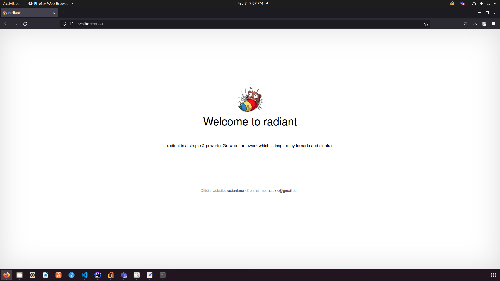

Requirements
============

Before starting any Radiant project make sure that you have installed
the ``radical`` tool and the ``radiant`` package. If you don’t have them
yet please read `Installing radiant <../install>`__ and `Installing
radical tool <../install/radical.html>`__ before you proceed.

Creating a new project
======================

Create a new Radiant project with the ```radical``
command <../install/radical.html>`__.

Open a terminal to your ``$GOPATH`` directory and enter
``radical new quickstart``:

::

   ➜  src  radical new quickstart
   [INFO] Creating application...
   /gopath/src/quickstart/
   /gopath/src/quickstart/conf/
   /gopath/src/quickstart/controllers/
   /gopath/src/quickstart/models/
   /gopath/src/quickstart/routers/
   /gopath/src/quickstart/tests/
   /gopath/src/quickstart/static/
   /gopath/src/quickstart/static/js/
   /gopath/src/quickstart/static/css/
   /gopath/src/quickstart/static/img/
   /gopath/src/quickstart/views/
   /gopath/src/quickstart/conf/app.conf
   /gopath/src/quickstart/controllers/default.go
   /gopath/src/quickstart/views/index.tpl
   /gopath/src/quickstart/routers/router.go
   /gopath/src/quickstart/tests/default_test.go
   2015/05/02 11:55:28 [SUCC] New application successfully created!

The radical tool has created a new Radiant project with the following
structure:

::

   quickstart
   ├── conf
   │   └── app.conf
   ├── controllers
   │   └── default.go
   ├── main.go
   ├── models
   ├── routers
   │   └── router.go
   ├── static
   │   ├── css
   │   ├── img
   │   └── js
   ├── tests
   │   └── default_test.go
   └── views
       └── index.tpl

This is a typical MVC application and ``main.go`` is the project’s main
file.

Running project
---------------

Go to the path of the newly created project and enter ``radical run`` to
compile and run the project.

::

   ➜  src  cd quickstart
   ➜  quickstart  radical run
   2015/05/02 12:01:31 [INFO] Uses 'quickstart' as 'appname'
   2015/05/02 12:01:31 [INFO] Initializing watcher...
   2015/05/02 12:01:31 [TRAC] Directory(/gopath/src/quickstart/controllers)
   2015/05/02 12:01:31 [TRAC] Directory(/gopath/src/quickstart)
   2015/05/02 12:01:31 [TRAC] Directory(/gopath/src/quickstart/routers)
   2015/05/02 12:01:31 [TRAC] Directory(/gopath/src/quickstart/tests)
   2015/05/02 12:01:31 [INFO] Start building...
   2015/05/02 12:01:36 [SUCC] Build was successful
   2015/05/02 12:01:36 [INFO] Restarting quickstart ...
   2015/05/02 12:01:36 [INFO] ./quickstart is running...
   2015/05/02 12:01:38 [app.go:103] [I] http server Running on :8080

The web application will run on the default Radiant port ``8080``. All
of this has been accomplished using only Go and Radiant, without the
need for nginx or apache. Let’s look at our application in the browser
now:

|image0|

Radiant makes it so easy to create a web application! Let’s dive into
the project now and see how everything works in the `next
section <router.html>`__.




.. toctree::
   :maxdepth: 4
   :caption: Contents:

   rst/quickstart
   rst/quickstart/README

.. toctree::
   :maxdepth: 4
   :caption: Quickstart Introduction:


   rst/quickstart/new
   rst/quickstart/router
   rst/quickstart/controller
   rst/quickstart/model
   rst/quickstart/view

.. toctree::
   :maxdepth: 4
   :caption: Introduction:

   rst/intro/Introduction
   rst/advantage/README
   rst/install/install
   rst/install/radical

.. toctree::
   :maxdepth: 4
   :caption: MVC Introduction:

   rst/mvc/README
.. toctree::
   :maxdepth: 4
   :caption: Controller:

   rst/mvc/controller/config
   rst/mvc/controller/controller
   rst/mvc/controller/error
   rst/mvc/controller/filter
   rst/mvc/controller/flash
   rst/mvc/controller/jsonxml
   rst/mvc/controller/params
   rst/mvc/controller/router
   rst/mvc/controller/session
   rst/mvc/controller/urlbuilding
   rst/mvc/controller/validation
   rst/mvc/controller/xsrf
.. toctree::
   :maxdepth: 4
   :caption: Models:

   rst/mvc/model/overview
   rst/mvc/model/orm
   rst/mvc/model/object
   rst/mvc/model/query
   rst/mvc/model/rawsql
   rst/mvc/model/querybuilder
   rst/mvc/model/transaction
   rst/mvc/model/models
   rst/mvc/model/commandline
   rst/mvc/model/test
   rst/mvc/model/custome_fields
   rst/mvc/model/faq

.. toctree::
   :maxdepth: 4
   :caption: Views:

   rst/mvc/view/view
   rst/mvc/view/template
   rst/mvc/view/static
   rst/mvc/view/page
   rst/mvc/view/global_variables

.. toctree::
   :maxdepth: 4
   :caption: Modules:

   rst/module/README
   rst/module/session
   rst/module/cache
   rst/module/logs
   rst/module/httplib
   rst/module/context
   rst/module/task
   rst/module/config

.. toctree::
   :maxdepth: 4
   :caption: Advanced Radiant:

   rst/advantage/README
   rst/advantage/monitor
   rst/advantage/docs

.. toctree::
   :maxdepth: 4
   :caption: Deployment:

   rst/deploy/README
   rst/deploy/radiant
   rst/deploy/supervisor
   rst/deploy/systemctl
   rst/deploy/nginx
   rst/deploy/apache

.. toctree::
   :maxdepth: 4
   :caption: FAQ:

   rst/faq/FAQ